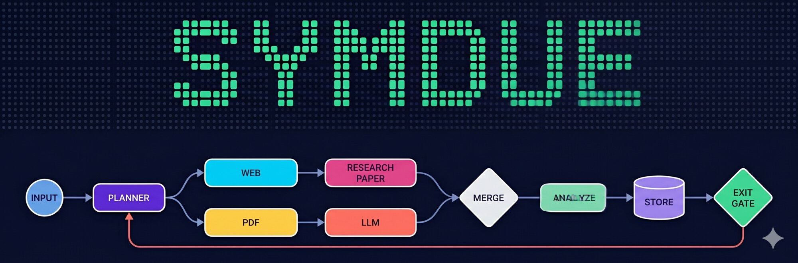

<p align="center">
  
</p>

<p align="center">
  <a href="https://youtu.be/aUr8gr9wKiA"></a>
  <a href="docs/FAQ.md"></a>
  <a href="docs/NODE_TYPE_API.md"></a>
  <a href="https://discord.gg/c3ysHGCyqs"></a>
  <a href="LICENSE"></a>
  <a href="https://github.com/vinodydev"></a>
</p>

<p align="center"><b>Visual workflow runtime for AI agents — durable, replay-safe, container-isolated.</b></p>

> **Note**: This project's working name was "Flowgraph" during early development. Renamed to **Symdue** ahead of public launch. The demo video below was recorded under the old name and will be re-recorded shortly.

## Demo

<p align="center">
  <a href="https://youtu.be/aUr8gr9wKiA">
    
  </a>
  <br />
  <em>▶ Watch the 2-minute Deep Research demo</em>
</p>

The demo runs a Deep Research workflow that:

- **Fans out across multiple sources**: parallel `WEB_SEARCH`, `PAPER_SEARCH`, and `PDF_READ` nodes triggered from a single user prompt.
- **Iterates to refine**: configurable max-iteration loop — initial findings feed back into a second-pass query before the report is produced.
- **Produces a structured report**: HTML output with executive summary, perspectives, confidence map, and source list — generated from the run's actual retrieved content, not a freeform LLM completion.
- **Whitelists citations**: only sources that actually exist in the run's retrieval whitelist can be cited; fabricated references are dropped at the storage boundary, not patched in post.
- **Survives browser refresh**: workflows execute on a Temporal substrate. Closing the tab, refreshing, or restarting the browser does not stop or reset the run; the UI reconnects to the live state on reload.
- **Per-node observability**: click any node after a run to see its logs, inputs, and outputs — the same data the workflow saw at that step.

> **Status:** early public release. The polished marketing-grade README is on its way; this stub gives you enough to clone, run, and contribute.

## What's in this repo

- `server/` — FastAPI backend, Temporal workers, LangGraph executor, signal/wait/event runtime, storage backends.
- `client/` — React + TypeScript canvas UI.
- `setup/` — Docker Compose for the full local stack (Postgres, Redis, Temporal, MinIO, backend, worker, frontend).

## Quickstart

```bash
cp server/.env.example server/.env
cd setup
docker compose up
```

Then open `http://localhost:3000`.

For non-Docker dev setup, see [`setup/setup-mac.sh`](setup/setup-mac.sh) and [`setup/setup-db.sh`](setup/setup-db.sh).

## What's here vs. what's not

This repo ships the **runtime substrate**:

- Visual canvas with free-form, weighted edges
- Temporal-backed durable execution with replay-from-checkpoint
- Eight built-in node types (Input, Custom Python, Custom LLM, Condition, Workflow, Workflow Template, Iterator, Wait)
- Signal channels with fan-out + multi-mode wait nodes
- Queue-event-to-workflow-input
- Six storage backends (Postgres, Redis, MongoDB, Chroma, MinIO/S3, local file)
- LLM provider adapters (OpenAI, Anthropic, Gemini, Perplexity, Ollama)
- Per-node container isolation, refresh-safe canvas, JSON workflow export/import

Higher-level products built on top of this substrate (specialized agent stacks, expertise/reasoning systems, managed deployments) live elsewhere.

## License

Symdue uses a **dual-license** structure:

- **Runtime: AGPL v3** — protects against hyperscaler-managed-service forks while keeping the code genuinely open and self-hostable. Self-hosting, modifying for your needs, and integrating via API are unrestricted. The AGPL clause kicks in only if you modify the runtime AND make it network-accessible to third parties. Same model as Grafana and MongoDB.
- **Plugin SDK: Apache 2.0** — your custom NodeTypes are your IP. Build them against the Apache 2.0 SDK and license them however you want (proprietary, MIT, AGPL, etc.). Same legal pattern as MySQL connectors (LGPL) or PostgreSQL extensions (BSD).
- **Demo workflows: Apache 2.0** — copy, modify, integrate freely.

For specific use cases that need to escape AGPL on the runtime (embedding Symdue in closed-source SaaS, hyperscaler-class managed services, proprietary runtime modifications), see [COMMERCIAL_LICENSE.md](COMMERCIAL_LICENSE.md).

Public commitments in [PRICING_PHILOSOPHY.md](PRICING_PHILOSOPHY.md): AGPL forever for the runtime, Apache forever for the SDK, no ads / no upsell prompts / no telemetry by default.

License files: [LICENSE](LICENSE) (overview) · [LICENSE-AGPL](LICENSE-AGPL) (full AGPL v3 text) · [LICENSE-APACHE](LICENSE-APACHE) (full Apache 2.0 text)

## Contributing

See [CONTRIBUTING.md](CONTRIBUTING.md). Runtime contributions require signing the [CLA](CLA.md) (one-click via CLA Assistant on first PR; standard for dual-licensed OSS projects). Apache 2.0 SDK / demo contributions accept Developer Certificate of Origin (DCO) sign-off only.

Security disclosures go to [SECURITY.md](SECURITY.md). This project follows the [Contributor Covenant](CODE_OF_CONDUCT.md).
