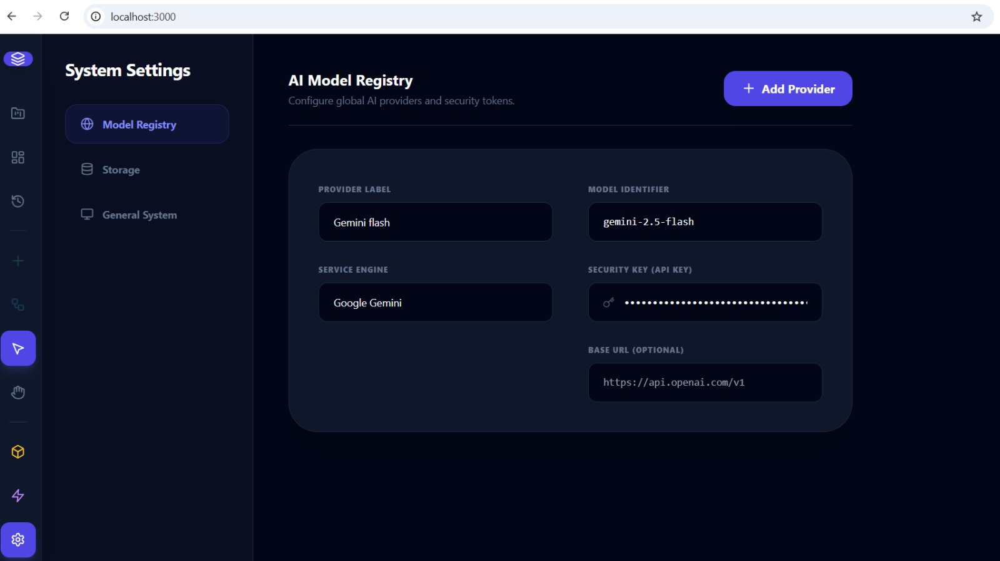
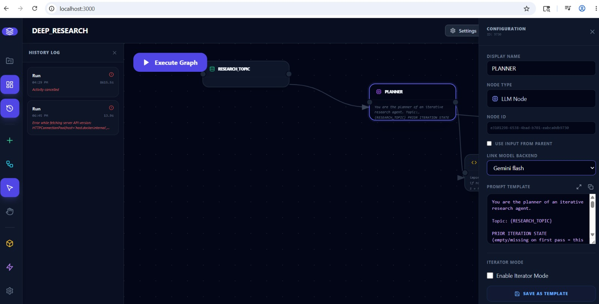

# Windows setup guide

Run the Symdue local stack on Windows using PowerShell, Docker Desktop, and the `symdue.ps1` helper in this folder. The script uses `docker-compose.windows.yml`, which connects containers to the Docker daemon over TCP (`host.docker.internal:2375`) instead of a Unix socket.

## Prerequisites

- **Windows 10/11** with [Docker Desktop](https://www.docker.com/products/docker-desktop/) installed and running
- **PowerShell** (Windows Terminal recommended)
- **Git** and a clone of this repository
- **VS Code** (or another editor) if you will edit workflow files in the repo

All commands below assume your shell is in the `setup` directory:

```powershell
cd path\to\symdue_oss\setup
```

## Pre-flight configuration

Complete these steps **before** your first `.\symdue.ps1 start`.

### 1. Use LF line endings in the repo

On Windows, Git and editors often default to CRLF. Symdue’s shell scripts and compose files expect **LF**.

In VS Code:

1. Open **Settings** and search for **End of Line**.
2. Set **Files: Eol** to `\n` (LF).
3. For this workspace only, you can add `.vscode/settings.json` with `"files.eol": "\n"`.

If files were already checked out with CRLF, re-normalize or re-clone after changing the setting.

### 2. Expose the Docker daemon on TCP (required)

Windows containers in this stack talk to Docker via `tcp://host.docker.internal:2375` (see `docker-compose.windows.yml`). Enable the TCP endpoint in Docker Desktop:

1. Open **Docker Desktop** → **Settings** → **General**.
2. Check **Expose daemon on tcp://localhost:2375 without TLS**.
3. Click **Apply & restart**.

> **Note:** This exposes the Docker API on localhost without TLS. Use only on a trusted development machine; do not enable on shared or production hosts.

## First-time setup

From the `setup` directory in PowerShell:

```powershell
# 1. Generate server/.env with random secrets (one-time)
.\symdue.ps1 init

# 2. Copy .env into setup/ so docker compose can read it
Copy-Item ..\server\.env .\.env -Force

# 3. Build and start the stack (first run may take several minutes)
.\symdue.ps1 start
```

When startup finishes:

- **Canvas UI:** [http://localhost:3000](http://localhost:3000)
- **API docs:** [http://localhost:8000/docs](http://localhost:8000/docs)

To stop the stack:

```powershell
.\symdue.ps1 stop
```

## Subsequent runs

After the first setup, you only need:

```powershell
.\symdue.ps1 start   # bring the stack up
.\symdue.ps1 stop    # stop containers
```

Other helpers:

```powershell
.\symdue.ps1 status  # show container state
.\symdue.ps1 logs    # follow compose logs
```

## Sample workflow

A ready-to-import **DEEP_RESEARCH** workflow ships in this folder:

- [`workflow-RESEARCH.json`](workflow-RESEARCH.json)

After the stack is running:

1. Open [http://localhost:3000](http://localhost:3000).
2. On the **Your Pipelines** screen, click **Import JSON**.
3. Select `workflow-RESEARCH.json` from this `setup` directory.

The workflow opens on the canvas. Continue below to wire up models before you run it.

## Configure AI models before running workflows

Imported workflows do not ship with your API keys. Configure a provider once, then attach it to each **LLM** node before you execute the graph.

### Step 1 — Add a provider in the Model Registry

1. Open [http://localhost:3000](http://localhost:3000).
2. Go to **System Settings** → **Model Registry**.
3. Click **+ Add Provider** and fill in your provider label, model identifier, service engine, and API key.



*Example: a Google Gemini provider with label `Gemini flash` and model `gemini-2.5-flash`.*

### Step 2 — Attach the model to LLM nodes

1. Open your workflow on the canvas.
2. Select each **LLM Node** (for example **PLANNER**).
3. In the node panel, set **Link Model Backend** to the provider you created.
4. Save the node, then run the workflow with **Execute Graph**.



*Each LLM node must reference a registry entry; otherwise execution will fail when the node calls the model API.*

## Troubleshooting

| Symptom | What to check |
|--------|----------------|
| Docker connection errors from containers | Docker Desktop is running and **Expose daemon on tcp://localhost:2375** is enabled |
| Compose errors about missing `.env` | Run `.\symdue.ps1 init` and `Copy-Item ..\server\.env .\.env -Force` from `setup/` |
| Port already in use | Another service is bound to 6379, 5433, or 3000 — see [docs/TROUBLESHOOTING.md](../docs/TROUBLESHOOTING.md) |
| Build failures during `start` | Retry after a network blip; see Yarn/DNS notes in troubleshooting |

For macOS/Linux setup, use [`symdue.sh`](symdue.sh) as described in the [README](../README.md).
